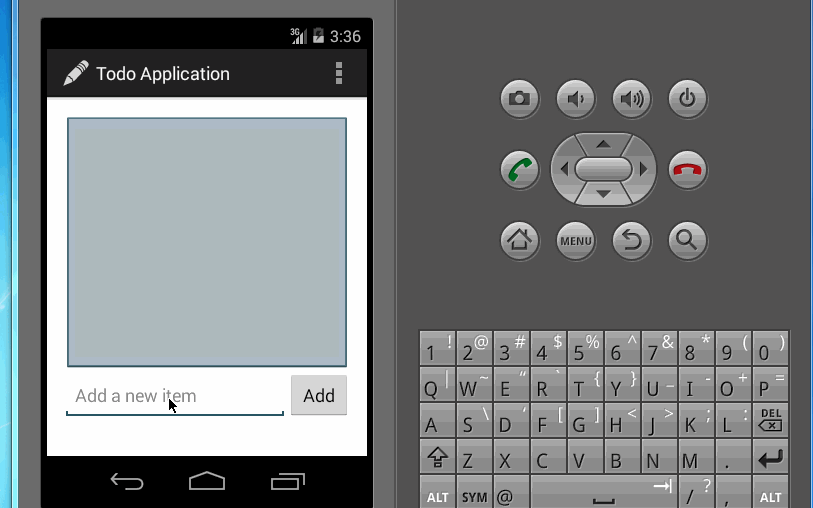

This is a todo application for keeping track of to do items.

Completed User Stories:
<ol>
<li>[Required] Build initial to do application</li>
<li>[Required] Add the edit functionality (using activity)</li>
<li>[Optional] Extend the edit functionality with DialogFragment</li>
<li>[Optional] Improved UI with icon</li>
<li>[Optional] Custom style</li>
</ol>

Walk through of all user stories:
 